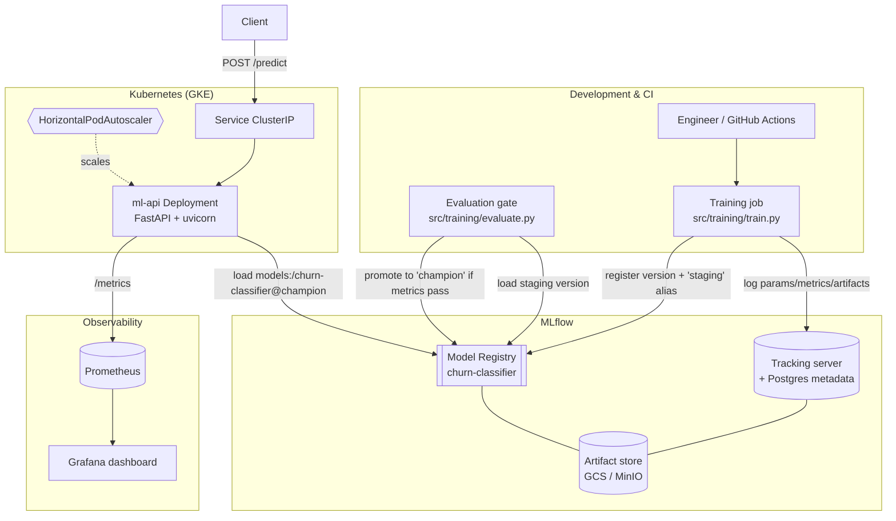
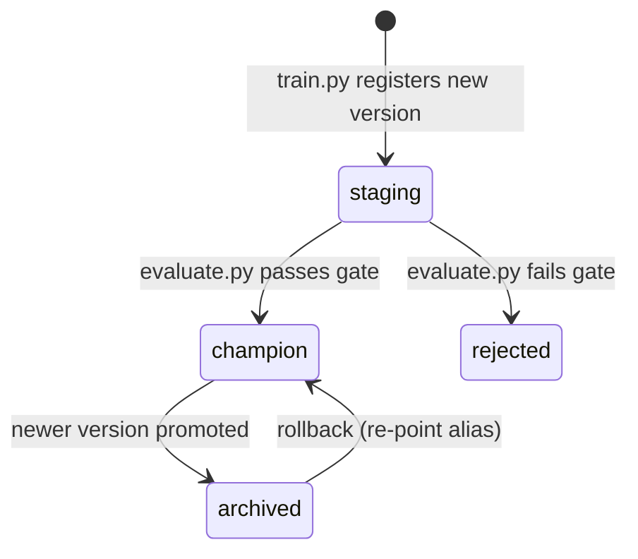

# Architecture

## System overview

## Component responsibilities

| Component | Path | Responsibility |
|-----------|------|----------------|
| Dataset generator | `src/common/dataset.py` | Deterministic synthetic churn data — no external data dependency |
| Feature schema | `src/common/schema.py` | Single source of truth for feature names/ranges shared by train + serve |
| Training | `src/training/train.py` | Fit GBM pipeline, log to MLflow, register version, set `staging` alias |
| Evaluation gate | `src/training/evaluate.py` | Re-score staging version, promote to `champion` only above thresholds |
| Model loader | `src/inference/model_loader.py` | Load `champion` from registry; documented local fallback |
| Inference API | `src/inference/main.py` | FastAPI: `/predict`, `/health`, `/ready`, `/metrics`, `/reload` |
| Helm chart | `helm/ml-api/` | Deploy, HPA, PDB, probes, ServiceMonitor, RBAC-light SA |
| Terraform | `terraform/` | Artifact Registry, GCS artifact store, spot training pool, Workload Identity |
| Monitoring | `monitoring/` | Prometheus alert rules + Grafana dashboard |
| CI/CD | `.github/workflows/` | Lint/test, build+scan+push images, gated GKE deploy |

## Data flow: train → serve

1. **Train** (`train.py`): generates data, fits a `StandardScaler → GradientBoostingClassifier`
   pipeline, logs params/metrics/artifacts + a model signature to MLflow, registers a new
   **version** of `churn-classifier`, and assigns it the `staging` alias.
2. **Evaluate/gate** (`evaluate.py`): loads the `staging` version, scores it on a fresh
   held-out set, and — only if `accuracy ≥ min` and `f1 ≥ min` — moves the `champion` alias
   onto that version. Otherwise it tags the version `rejected` and leaves `champion` untouched.
3. **Build/deploy** (CI): container images are built, scanned with Trivy, pushed, and the
   Helm release is upgraded on GKE (environment-gated).
4. **Serve** (`main.py`): on startup the pod loads `models:/churn-classifier@champion`. If the
   registry is unreachable it may fall back to a local model (configurable). `/ready` reports
   503 until a model is loaded so Kubernetes keeps traffic away.
5. **Observe**: the API exposes Prometheus metrics; Prometheus scrapes `/metrics`; Grafana
   visualises request rate, latency percentiles, error rate, and prediction distribution.

## Model lifecycle (alias transitions)

Aliases (not the deprecated stage strings) drive the lifecycle. Because moving an alias is
atomic and instantaneous, **rollback is simply re-pointing `champion` at a previous version**,
followed by a `POST /reload` (or pod restart) on the API. See the README "Failure & rollback"
section.
