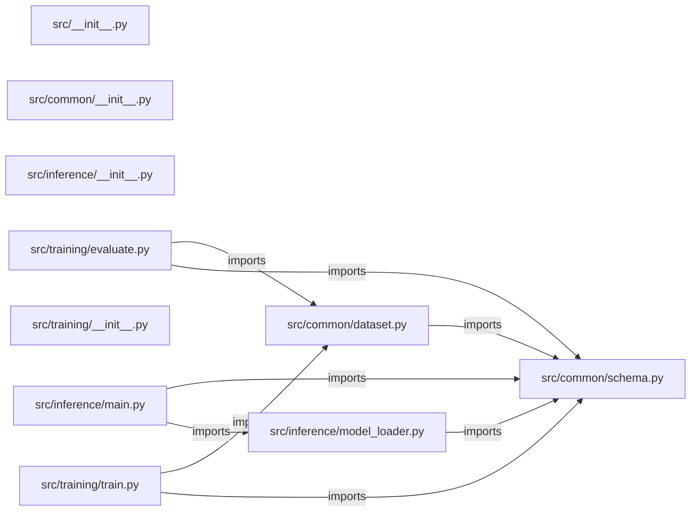
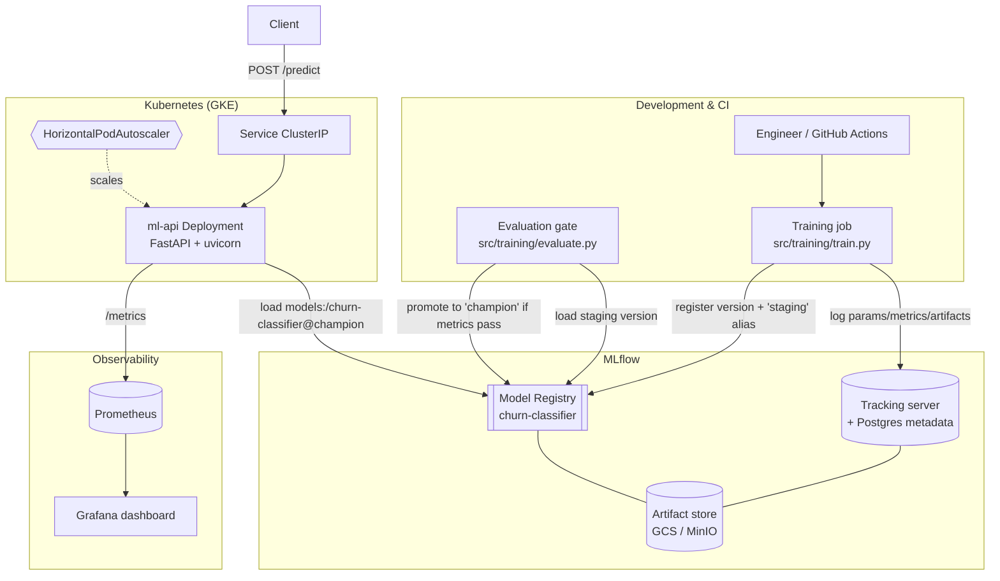

# kubernetes-mlops-platform — project architecture

[README](README.md) · [Interview questions and answers](INTERVIEW_QA.md)

## Purpose and scope

An end-to-end MLOps reference with MLflow, FastAPI, Docker, Kubernetes, Helm, Prometheus, Grafana, and GitHub Actions.

This document describes files and symbols in this checkout. Deployment templates and statements in the original overview are distinguished from a verified running environment.

## Component diagram



For Python repositories, arrows show resolved local imports, not network calls or deployment order. Otherwise the diagram is a repository component map; containment arrows do not assert runtime integration.

## Components and responsibilities

| Component | Responsibility |
| --- | --- |
| [`src/inference/main.py`](src/inference/main.py) | HTTP handlers: `GET /`, `GET /health`, `GET /ready`, `GET /metrics`, `POST /reload` |
| [`src/common/dataset.py`](src/common/dataset.py) | Functions: `generate_dataset`, `_z` |
| [`src/training/evaluate.py`](src/training/evaluate.py) | Functions: `parse_args`, `resolve_version`, `evaluate_version`, `gate_and_promote`, `main` |
| [`src/inference/model_loader.py`](src/inference/model_loader.py) | Functions: `_load_from_registry`, `_load_from_local`, `load_model`, `get_cached_model`, `reset_cache` |
| [`src/training/train.py`](src/training/train.py) | Functions: `parse_args`, `build_model`, `compute_metrics`, `_log_json_artifact`, `register_model_version`, `main` |
| [`requirements.txt`](requirements.txt) | Implementation or supporting configuration |
| [`terraform/main.tf`](terraform/main.tf) | Terraform resource/module declarations |
| [`terraform/modules/artifact-registry/main.tf`](terraform/modules/artifact-registry/main.tf) | Terraform resource/module declarations |
| [`terraform/modules/artifact-registry/outputs.tf`](terraform/modules/artifact-registry/outputs.tf) | Terraform resource/module declarations |
| [`terraform/modules/artifact-registry/variables.tf`](terraform/modules/artifact-registry/variables.tf) | Terraform resource/module declarations |
| [`terraform/modules/gcs-bucket/main.tf`](terraform/modules/gcs-bucket/main.tf) | Terraform resource/module declarations |
| [`src/__init__.py`](src/__init__.py) | Implementation or supporting configuration |
| [`terraform/outputs.tf`](terraform/outputs.tf) | Terraform resource/module declarations |
| [`terraform/variables.tf`](terraform/variables.tf) | Terraform resource/module declarations |
| [`terraform/versions.tf`](terraform/versions.tf) | Terraform resource/module declarations |
| [`src/common/__init__.py`](src/common/__init__.py) | Implementation or supporting configuration |
| [`src/common/schema.py`](src/common/schema.py) | Implementation or supporting configuration |
| [`Makefile`](Makefile) | Implementation or supporting configuration |
| [`docker-compose.yml`](docker-compose.yml) | Container build/service configuration |
| [`docker/Dockerfile.inference`](docker/Dockerfile.inference) | Implementation or supporting configuration |
| [`docker/Dockerfile.training`](docker/Dockerfile.training) | Implementation or supporting configuration |
| [`tests/__init__.py`](tests/__init__.py) | Executable checks and regression examples |

## Existing design and operating guides

These checked-in guides provide the project’s detailed design, operational context, or deployment view:

- [`ARCHITECTURE.md`](ARCHITECTURE.md).
- [`SECURITY.md`](SECURITY.md).

### Existing deployment/design view

The following view is retained from [`ARCHITECTURE.md`](ARCHITECTURE.md). Read that guide for its assumptions and the distinction between configured and deployed components.



## Request interface

| Method and path | Handler | Source |
| --- | --- | --- |
| `GET /` | `root` | [`src/inference/main.py`](src/inference/main.py#L182) |
| `GET /health` | `health` | [`src/inference/main.py`](src/inference/main.py#L195) |
| `GET /ready` | `ready` | [`src/inference/main.py`](src/inference/main.py#L201) |
| `GET /metrics` | `metrics` | [`src/inference/main.py`](src/inference/main.py#L215) |
| `POST /reload` | `reload_model` | [`src/inference/main.py`](src/inference/main.py#L221) |
| `POST /predict` | `predict` | [`src/inference/main.py`](src/inference/main.py#L239) |

The table lists literal route decorators found in the inspected Python modules. Router prefixes and middleware can add behavior; check the linked handler and application setup before calling an endpoint.

## Implementation walkthrough

### `generate_dataset(n_samples: int=8000, seed: int=42)`

Source: [`src/common/dataset.py`](src/common/dataset.py#L22).

Generate a reproducible synthetic churn dataset.

Parameters
----------
n_samples:
    Number of rows to generate.
seed:
    RNG seed for reproducibility.

Returns
-------
pandas.DataFrame
    A frame with :data:`FEATURE_NAMES` columns plus the binary
    :data:`TARGET_NAME` column.

Calls visible in this function: `_z`, `churned.astype`, `np.exp`, `np.random.default_rng`, `num_logins_last_30d.astype`, `num_support_tickets.astype`, `pd.DataFrame`, `rng.binomial`, `rng.binomial(1, 0.35, size=n_samples).astype`, `rng.gamma`, `rng.gamma(shape=2.0, scale=12.0, size=n_samples).clip`, `rng.gamma(shape=2.0, scale=40.0, size=n_samples).clip`.

```python
def generate_dataset(n_samples: int = 8_000, seed: int = 42) -> pd.DataFrame:
    """Generate a reproducible synthetic churn dataset.

    Parameters
    ----------
    n_samples:
        Number of rows to generate.
    seed:
        RNG seed for reproducibility.

    Returns
    -------
    pandas.DataFrame
        A frame with :data:`FEATURE_NAMES` columns plus the binary
        :data:`TARGET_NAME` column.
    """
    rng = np.random.default_rng(seed)

    account_age_months = rng.gamma(shape=2.0, scale=12.0, size=n_samples).clip(0, 240)
    monthly_charges = rng.normal(70, 25, size=n_samples).clip(5, 500)
    total_charges = (monthly_charges * account_age_months) * rng.uniform(
        0.8, 1.2, size=n_samples
```

The excerpt is truncated; the linked source contains the full implementation.

### `gate_and_promote(client: MlflowClient, version: str, metrics: dict, args: argparse.Namespace)`

Source: [`src/training/evaluate.py`](src/training/evaluate.py#L95).

Promote to the production alias iff metrics clear the thresholds.

Calls visible in this function: `client.set_model_version_tag`, `client.set_registered_model_alias`, `logger.info`, `logger.warning`.

```python
def gate_and_promote(
    client: MlflowClient, version: str, metrics: dict, args: argparse.Namespace
) -> bool:
    """Promote to the production alias iff metrics clear the thresholds."""
    passed = (
        metrics["eval_accuracy"] >= args.min_accuracy
        and metrics["eval_f1"] >= args.min_f1
    )
    if passed:
        client.set_registered_model_alias(
            REGISTERED_MODEL_NAME, PRODUCTION_ALIAS, version
        )
        client.set_model_version_tag(
            REGISTERED_MODEL_NAME, version, "validation_status", "approved"
        )
        logger.info(
            "PROMOTED %s v%s to alias '%s' (accuracy=%.3f f1=%.3f)",
            REGISTERED_MODEL_NAME,
            version,
            PRODUCTION_ALIAS,
            metrics["eval_accuracy"],
            metrics["eval_f1"],
```

The excerpt is truncated; the linked source contains the full implementation.

### `load_model(force_reload: bool=False)`

Source: [`src/inference/model_loader.py`](src/inference/model_loader.py#L99).

Return the served model, loading (and caching) it on first use.

Registry first, then local fallback (unless ``ALLOW_LOCAL_FALLBACK=false``).
Thread-safe and idempotent.

Calls visible in this function: `ModelLoadError`, `_load_from_local`, `_load_from_registry`, `logger.warning`, `os.getenv`, `os.getenv('ALLOW_LOCAL_FALLBACK', 'true').lower`.

```python
def load_model(force_reload: bool = False) -> LoadedModel:
    """Return the served model, loading (and caching) it on first use.

    Registry first, then local fallback (unless ``ALLOW_LOCAL_FALLBACK=false``).
    Thread-safe and idempotent.
    """
    global _CACHE
    with _LOCK:
        if _CACHE is not None and not force_reload:
            return _CACHE

        allow_fallback = os.getenv("ALLOW_LOCAL_FALLBACK", "true").lower() == "true"
        registry_error: Exception | None = None

        try:
            _CACHE = _load_from_registry()
            return _CACHE
        except Exception as exc:  # noqa: BLE001 - we intentionally degrade
            registry_error = exc
            logger.warning("Registry load failed: %s", exc)

        if allow_fallback:
```

The excerpt is truncated; the linked source contains the full implementation.

### `register_model_version(model_uri: str)`

Source: [`src/training/train.py`](src/training/train.py#L128).

Register ``model_uri`` and tag the new version with the staging alias.

Returns the version string that was created.

Calls visible in this function: `MlflowClient`, `client.create_registered_model`, `client.set_model_version_tag`, `client.set_registered_model_alias`, `logger.info`, `mlflow.register_model`.

```python
def register_model_version(model_uri: str) -> str:
    """Register ``model_uri`` and tag the new version with the staging alias.

    Returns the version string that was created.
    """
    client = MlflowClient()
    # Ensure the registered model container exists (idempotent).
    try:
        client.create_registered_model(REGISTERED_MODEL_NAME)
        logger.info("Created registered model %s", REGISTERED_MODEL_NAME)
    except mlflow.exceptions.MlflowException:
        logger.info("Registered model %s already exists", REGISTERED_MODEL_NAME)

    result = mlflow.register_model(model_uri=model_uri, name=REGISTERED_MODEL_NAME)
    version = result.version
    # Alias-based lifecycle (the modern replacement for deprecated stages).
    client.set_registered_model_alias(REGISTERED_MODEL_NAME, STAGING_ALIAS, version)
    client.set_model_version_tag(
        REGISTERED_MODEL_NAME, version, "validation_status", "pending"
    )
    logger.info(
        "Registered %s v%s and set alias '%s'",
```

The excerpt is truncated; the linked source contains the full implementation.

## Validation and failure paths

| Explicit exception | Source |
| --- | --- |
| `HTTPException(status_code=422, detail=f'instance {i} missing features: {missing}')` | [`src/inference/main.py`](src/inference/main.py#L126) |
| `HTTPException(status_code=503, detail=str(exc))` | [`src/inference/main.py`](src/inference/main.py#L228) |
| `HTTPException(status_code=500, detail=f'inference error: {exc}')` | [`src/inference/main.py`](src/inference/main.py#L265) |
| `HTTPException(status_code=422, detail=f"instance {i} feature '{f}'={val} out of range [{spec.minimum}, {spec.maximum}]")` | [`src/inference/main.py`](src/inference/main.py#L141) |
| `HTTPException(status_code=503, detail=f'model unavailable: {exc}')` | [`src/inference/main.py`](src/inference/main.py#L250) |
| `HTTPException(status_code=422, detail=f"instance {i} feature '{f}' is not numeric")` | [`src/inference/main.py`](src/inference/main.py#L135) |
| `ModelLoadError(f"No local model at '{path}'. Run training with MLFLOW_TRACKING_URI unset to populate ./mlruns, or export a model to LOCAL_MODEL_PATH.")` | [`src/inference/model_loader.py`](src/inference/model_loader.py#L87) |
| `ModelLoadError(f'Registry load failed and local fallback disabled: {registry_error}')` | [`src/inference/model_loader.py`](src/inference/model_loader.py#L130) |
| `ModelLoadError(f'Registry load failed ({registry_error}); local fallback also failed ({exc}).')` | [`src/inference/model_loader.py`](src/inference/model_loader.py#L125) |
| `SystemExit(0 if result['promoted'] else 1)` | [`src/training/evaluate.py`](src/training/evaluate.py#L158) |

These are explicit exceptions in the inspected source, rather than a claim that every failure is handled. Follow the calling handler to see whether the exception becomes an HTTP response or propagates.

## Data and state

- [`src/common/schema.py`](src/common/schema.py) defines module-level containers: `FEATURE_NAMES`, `CLASS_LABELS`, `FEATURE_SPECS`.

Module-level dictionaries/lists live in a Python process. They can be fixtures or mutable state; inspect writes before treating them as persistent storage. A production extension would need to define persistence and concurrency behavior explicitly.

## Infrastructure declarations

| Kind | Address | Source |
| --- | --- | --- |
| resource | `google_container_node_pool.training` | [`terraform/main.tf`](terraform/main.tf) |
| resource | `google_service_account.gke_nodes` | [`terraform/main.tf`](terraform/main.tf) |
| resource | `google_project_iam_member.gke_nodes_roles` | [`terraform/main.tf`](terraform/main.tf) |
| resource | `google_service_account.ml_api` | [`terraform/main.tf`](terraform/main.tf) |
| resource | `google_storage_bucket_iam_member.ml_api_artifacts` | [`terraform/main.tf`](terraform/main.tf) |
| resource | `google_service_account_iam_member.ml_api_workload_identity` | [`terraform/main.tf`](terraform/main.tf) |
| resource | `google_artifact_registry_repository.this` | [`terraform/modules/artifact-registry/main.tf`](terraform/modules/artifact-registry/main.tf) |
| resource | `google_storage_bucket.this` | [`terraform/modules/gcs-bucket/main.tf`](terraform/modules/gcs-bucket/main.tf) |

These are declarations in the checkout. Provisioning, an authenticated provider, remote state, and a successful deployment are separate operational steps. Refer to the environment-specific instructions before planning changes.

## Data flow and design decisions

### What is the input-to-output contract of `generate_dataset`

In [`src/common/dataset.py`](src/common/dataset.py#L22), `generate_dataset(n_samples: int=8000, seed: int=42)` receives the inputs. The function computes these intermediate values:

- `rng = np.random.default_rng(seed)`
- `account_age_months = rng.gamma(shape=2.0, scale=12.0, size=n_samples).clip(0, 240)`
- `monthly_charges = rng.normal(70, 25, size=n_samples).clip(5, 500)`
- `total_charges = monthly_charges * account_age_months * rng.uniform(0.8, 1.2, size=n_samples)`
- `num_support_tickets = rng.poisson(1.5, size=n_samples).clip(0, 100)`
- `avg_latency_ms = rng.normal(180, 90, size=n_samples).clip(1, 5000)`
- `data_usage_gb = rng.gamma(shape=2.0, scale=40.0, size=n_samples).clip(0, 10000)`

Its result is defined by:

- `frame`

### Which Terraform modules compose the environment

- `module.artifact_registry` uses `./modules/artifact-registry` in [`terraform/main.tf`](terraform/main.tf).
- `module.mlflow_artifacts` uses `./modules/gcs-bucket` in [`terraform/main.tf`](terraform/main.tf).

Review each module’s variable and output contracts. Different environment declarations may reuse a module with different inputs; state and provider configuration determine the actual deployment boundary.

## Setup and verification

The following commands are derived from the checked-in dependency/test contracts. Execute them from the repository root; the block prepares a local environment, not a cloud deployment.

```bash
python3 -m venv .venv
source .venv/bin/activate
python -m pip install -r requirements.txt
python -m pytest -q
```

Python dependencies: [`requirements.txt`](requirements.txt).

Test entry points: [`tests/__init__.py`](tests/__init__.py), [`tests/conftest.py`](tests/conftest.py), [`tests/test_api.py`](tests/test_api.py), [`tests/test_dataset.py`](tests/test_dataset.py), [`tests/test_model_loader.py`](tests/test_model_loader.py), [`tests/test_training.py`](tests/test_training.py).

Automation definitions: [`.github/workflows/ci.yml`](.github/workflows/ci.yml), [`.github/workflows/deploy.yml`](.github/workflows/deploy.yml), [`.github/workflows/docker-build.yml`](.github/workflows/docker-build.yml). Read their triggers and job steps to determine what CI actually runs.

## Operating boundaries and design review

Before turning this checkout into a customer deployment, establish the input contract, data ownership, access controls, failure response, evaluation criteria, and rollback owner. Repository fixtures and unit tests demonstrate local behavior; they do not establish throughput, uptime, compliance, or business impact.

A useful architecture review starts with the linked implementation: identify where input enters, where a decision is made, which state can change, and which external dependency can fail. Add a deployment view only for infrastructure that is actually configured and exercised.
