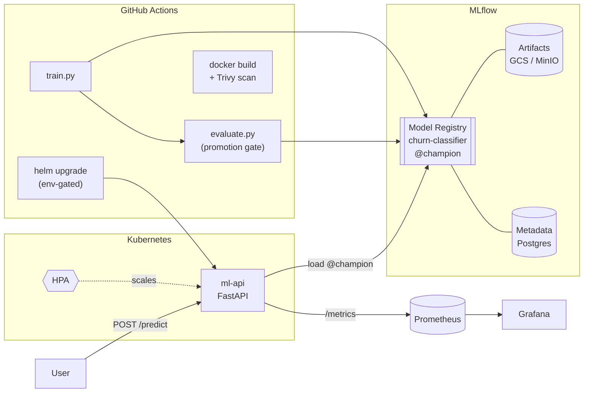
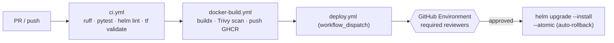

# Production MLOps Platform on Kubernetes

An end-to-end, production-shaped MLOps platform: train a classifier, govern it
through the MLflow Model Registry, serve it behind a FastAPI inference API,
containerize it, deploy it to Kubernetes with Helm (probes + autoscaling),
observe it with Prometheus + Grafana, and ship it through GitHub Actions.

> **Honesty note.** This repository is infrastructure-as-code, not a hosted
> demo. Everything that can run locally does (the Python runs, the tests pass,
> `helm lint`/`helm template` render, `terraform validate` passes). There is **no
> live cluster, public demo URL, or screenshots** attached — the cloud steps
> below are written to be followed against *your own* GCP project.

[](https://github.com/iarsingh/kubernetes-mlops-platform/actions/workflows/ci.yml)


---

## 1. The business problem

Getting a model to good accuracy in a notebook is the easy 10%. The hard,
value-creating 90% is everything after: **reproducibility, governance, safe
rollout, and operability**. Teams that skip this ship models nobody can
reproduce, can't explain which version is live, can't roll back a bad model
quickly, and have no visibility when predictions silently degrade.

This platform demonstrates the disciplines that make ML safe in production:

- **Reproducibility** — data generation, params, metrics, and artifacts are all
  tracked in MLflow; a run can be reproduced from its logged inputs.
- **Model governance** — every trained model becomes a **versioned** registry
  entry. Promotion to production is **gated** on evaluation thresholds, not a
  human eyeballing a notebook.
- **Safe rollout & rollback** — the served model is selected by an **alias**
  (`champion`). Promotion and rollback are atomic alias moves; the deploy uses
  Helm `--atomic` so a failed rollout auto-reverts.
- **Operability** — health/readiness probes, autoscaling, Prometheus metrics,
  alert rules, and a Grafana dashboard make the service observable and
  self-healing.

The example task is **customer churn** prediction, but the scaffolding is
domain-agnostic — swap the dataset and feature schema and the rest stands.

## 2. Architecture



**Narrative.** Training logs to MLflow and registers a new model *version* with
the `staging` alias. The evaluation step re-scores that version on fresh data and
promotes it to `champion` only if it clears accuracy/F1 thresholds. CI builds and
scans the container images and deploys the chart to GKE. The inference pod loads
`models:/churn-classifier@champion` on startup and serves `/predict`. Prometheus
scrapes the pod's `/metrics`; Grafana renders latency, throughput, error rate,
and prediction distribution. See [ARCHITECTURE.md](ARCHITECTURE.md) for the full
diagram, component table, and model lifecycle state machine.

## 3. Technology stack

| Layer | Technology | Why |
|-------|-----------|-----|
| Model | scikit-learn (GradientBoosting) | Solid tabular baseline, easy to reason about |
| Experiment tracking + registry | MLflow 3 | Versioning, aliases, lifecycle, artifact store |
| Serving | FastAPI + uvicorn | Async, typed, auto OpenAPI docs |
| Metrics | prometheus-client | Native Prometheus exposition |
| Packaging | Docker (multi-stage, non-root) | Small, hardened images |
| Orchestration | Kubernetes + Helm | Declarative deploy, probes, autoscaling |
| Infra | Terraform (GCP) | Artifact Registry, GCS, GKE pool, Workload Identity |
| Observability | Prometheus + Grafana | Alerting rules + dashboard |
| CI/CD | GitHub Actions | Lint/test, build+scan, gated deploy |
| Artifact store (local) | MinIO (S3-compatible) | Cloud-parity local dev |
| Metadata store | PostgreSQL / Cloud SQL | MLflow backend |

## 4. Repository structure

```
kubernetes-mlops-platform/
├── src/
│   ├── common/           # shared feature schema + deterministic dataset generator
│   ├── training/         # train.py (register + stage) · evaluate.py (gate + promote)
│   └── inference/        # main.py (FastAPI) · model_loader.py (registry + fallback)
├── tests/                # pytest: dataset, training, API (TestClient), mocked MLflow
├── docker/               # Dockerfile.inference · Dockerfile.training (multi-stage, non-root)
├── helm/ml-api/          # Helm chart: deployment/probes/HPA/PDB/SA/ConfigMap/ServiceMonitor
├── kubernetes/           # namespace (restricted PSS) + default-deny NetworkPolicies
├── monitoring/
│   ├── prometheus/       # PrometheusRule (alerts) · ServiceMonitor · scrape-config example
│   └── grafana/          # importable dashboard JSON
├── terraform/            # GCP modules: Artifact Registry, GCS, GKE spot pool, Workload Identity
├── .github/workflows/    # ci.yml · docker-build.yml · deploy.yml
├── docker-compose.yml    # local stack: postgres + minio + mlflow + api
├── Makefile              # train/test/lint/docker/helm/port-forward targets
├── ARCHITECTURE.md · SECURITY.md · CONTRIBUTING.md
└── README.md
```

## 5. Local setup

Prereqs: Python 3.12+ and Docker. `helm`/`kubectl`/`terraform` for the K8s parts.

### Option A — full stack with `docker compose` (recommended)

Brings up Postgres, MinIO, the MLflow server, and the inference API:

```bash
cp .env.example .env
docker compose up --build -d          # or: make compose-up

# Train + register against the local MLflow, then run the promotion gate
docker compose run --rm mlflow python -m src.training.train
docker compose run --rm mlflow python -m src.training.evaluate

# Tell the API to pick up the freshly promoted champion, then predict
curl -X POST localhost:8000/reload
curl localhost:8000/ready
```

MLflow UI: <http://localhost:5000> · MinIO console: <http://localhost:9001>.

### Option B — no containers (venv + SQLite)

```bash
make venv && source .venv/bin/activate      # installs requirements.txt
make train    MLFLOW_TRACKING_URI=sqlite:///mlflow.db
make evaluate MLFLOW_TRACKING_URI=sqlite:///mlflow.db
MLFLOW_TRACKING_URI=sqlite:///mlflow.db make serve   # uvicorn on :8000
```

Run the checks:

```bash
make test        # 19 pytest tests
make lint        # ruff
make helm-lint   # helm lint
make tf-validate # terraform fmt + validate
```

## 6. Cloud deployment (your own GCP project)

> These are followable instructions, not an already-live deployment.

**Prereqs**: a GCP project, a GKE cluster with Workload Identity enabled,
`gcloud`/`kubectl`/`terraform`/`helm` authenticated.

```bash
# 1. Provision supporting infra (Artifact Registry, GCS artifact store,
#    spot training node pool, Workload Identity service account).
cd terraform
cp terraform.tfvars.example terraform.tfvars   # set project_id, cluster_name, ...
terraform init
terraform apply

# 2. Bind the Kubernetes SA to the Google SA for keyless GCS access.
kubectl create namespace mlops --dry-run=client -o yaml | kubectl apply -f -
kubectl annotate sa ml-api -n mlops \
  iam.gke.io/gcp-service-account=$(terraform output -raw ml_api_gcp_service_account)

# 3. Apply namespace policies (restricted PSS + NetworkPolicies).
kubectl apply -f ../kubernetes/

# 4. Create the artifact-store secret (or use External Secrets / Workload Identity).
kubectl create secret generic ml-api-artifact-store -n mlops \
  --from-literal=AWS_ACCESS_KEY_ID=... --from-literal=AWS_SECRET_ACCESS_KEY=... \
  --from-literal=MLFLOW_S3_ENDPOINT_URL=https://storage.googleapis.com

# 5. Deploy the app.
helm upgrade --install ml-api ../helm/ml-api -n mlops \
  --set image.repository=$(terraform output -raw artifact_registry_repository)/ml-api \
  --set image.tag=<GIT_SHA> \
  --set config.mlflowTrackingUri=http://mlflow.mlflow.svc.cluster.local:5000 \
  --set existingSecret=ml-api-artifact-store \
  --set serviceMonitor.enabled=true --wait --atomic
```

Images are built and pushed by CI (`docker-build.yml`); use a commit SHA tag for
immutable, traceable deploys.

## 7. CI/CD flow



- **`ci.yml`** — ruff lint + format check, pytest with coverage, `helm lint` +
  template render, `terraform fmt`/`validate`. Runs on every push and PR.
- **`docker-build.yml`** — matrix-builds both images with Buildx, scans each with
  **Trivy** (fails on fixable CRITICAL/HIGH) *before* pushing to GHCR, uploads
  SARIF to code scanning.
- **`deploy.yml`** — manual `workflow_dispatch`, authenticates to GCP via
  **Workload Identity Federation** (no static keys), and runs
  `helm upgrade --install --atomic`. The `production` **GitHub Environment**
  should have **required reviewers**, so the deploy waits for human approval.

## 8. Security controls

Highlights (full detail in [SECURITY.md](SECURITY.md)):

- Non-root, multi-stage, pinned-base container images; `readOnlyRootFilesystem`,
  dropped capabilities, seccomp `RuntimeDefault`, no service-account token mount.
- `restricted` Pod Security Standard on the namespace; **default-deny**
  NetworkPolicies with an explicit allowlist (and metadata-endpoint egress
  blocked to mitigate SSRF).
- No secrets in git; runtime creds via Kubernetes Secrets / **Workload Identity**;
  deploy auth via **OIDC** (WIF).
- **Trivy** image scanning gating the build; immutable Artifact Registry tags;
  least-privilege service accounts.

## 9. Monitoring & the Grafana dashboard

The API exposes Prometheus metrics at `/metrics`:

| Metric | Type | Meaning |
|--------|------|---------|
| `ml_predictions_total{predicted_label}` | counter | predictions by class |
| `ml_prediction_errors_total{reason}` | counter | failed requests by reason |
| `ml_prediction_latency_seconds` | histogram | `/predict` latency |
| `ml_predicted_probability` | histogram | churn-probability distribution |
| `ml_model_loaded` | gauge | 1 if a servable model is loaded |

The importable dashboard (`monitoring/grafana/ml-api-dashboard.json`) has panels
for **request rate**, **error rate**, **p50/p95/p99 latency**, **model-loaded
status**, **request rate by predicted class**, **errors by reason**, and a
**predicted-class distribution** donut. Alert rules
(`monitoring/prometheus/prometheusrule.yaml`) cover high error rate, high p95
latency, pod restarts, model-inference failures, and "no model loaded".

> No screenshots are included — this repo is not attached to a live cluster.
> Import the JSON into your own Grafana pointed at a Prometheus that scrapes the
> service to see it populated.

## 10. Failure & rollback

**Model rollback (governance layer).** The served model is whatever version the
`champion` alias points at. To roll back a bad model, re-point the alias at the
previous version and reload — no redeploy needed:

```python
from mlflow.tracking import MlflowClient
MlflowClient().set_registered_model_alias("churn-classifier", "champion", "<PREV_VERSION>")
```
```bash
curl -X POST http://<service>/reload   # or: kubectl rollout restart deploy/ml-api -n mlops
```

**Deploy rollback (infra layer).** Deploys run `helm upgrade --install --atomic`,
so a failed rollout (probes never go ready) is **automatically rolled back**. To
revert a healthy-but-bad release manually:

```bash
helm history ml-api -n mlops
helm rollback ml-api <REVISION> -n mlops
```

**Degradation behaviour.** If MLflow is unreachable at startup the pod does not
crash-loop: `/ready` returns 503 so Kubernetes keeps traffic on healthy pods,
and (if enabled) the loader falls back to a local model. `/health` (liveness)
stays green so the process isn't killed while it waits for the registry.

## 11. Cost considerations

- **GKE Autopilot vs Standard** — Autopilot bills per-pod (no idle node cost),
  great for spiky inference; Standard gives node-level control and is cheaper at
  steady high utilization. The training pool here is **Standard + Spot**.
- **Spot nodes for training** — the training node pool uses Spot VMs (up to
  ~60–90% cheaper) and scales to **zero** (`training_min_nodes = 0`) when idle,
  since training is batch and restartable. It's tainted so only training Jobs
  land there.
- **Cloud SQL vs self-hosted Postgres** — Cloud SQL is managed (backups, HA) but
  carries a standing cost; for dev/low-traffic, self-hosted Postgres (as in
  `docker-compose.yml`) or a small instance is far cheaper. This repo does **not**
  provision Cloud SQL by default to avoid an idle bill.
- **Artifact storage** — the GCS bucket has a 180-day lifecycle rule and
  Artifact Registry prunes untagged images after 30 days to cap storage cost.
- **Right-sizing** — inference requests/limits are modest (250m CPU / 512Mi) with
  an HPA (2–10 replicas) so you pay for load actually served, and a PDB keeps
  availability during scale-down.

## 12. Sample `/predict` request

The model consumes eight tabular features (see `src/common/schema.py`):

```bash
curl -s -X POST http://localhost:8000/predict \
  -H 'Content-Type: application/json' \
  -d '{
        "instances": [
          {
            "account_age_months": 8,
            "monthly_charges": 89.5,
            "total_charges": 716.0,
            "num_support_tickets": 4,
            "avg_latency_ms": 320,
            "data_usage_gb": 55.2,
            "num_logins_last_30d": 6,
            "is_premium": 0
          }
        ]
      }'
```

Response:

```json
{
  "predictions": [
    { "predicted_class": 1, "predicted_label": "churned", "churn_probability": 0.7124 }
  ],
  "model_source": "registry",
  "model_version": "3"
}
```

Interactive OpenAPI docs are served at `http://localhost:8000/docs`.

---

## License

[MIT](LICENSE).
